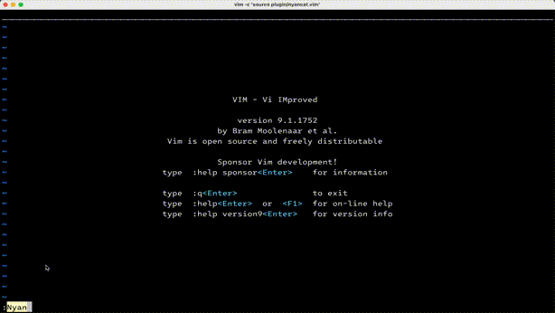

# Nyancat.vim
Animated [Nyan Cat](https://www.youtube.com/watch?v=QH2-TGUlwu4) in a Vim popup window with full rainbow colors, auto-scaling, and a customizable border.


## Features
- Smooth Nyan Cat animation in a central popup window
- Auto-scaling to fit your terminal size and avoid errors
- Customizable border styles, including a rainbow mode
- Configurable animation speed and status message
- Full 256-color support for an authentic experience

## Requirements
- Vim 8.0+ with the `+popupwin` feature
- A terminal with 256-color support

## Installation
Install using your favorite plugin manager:

[vim-plug](https://github.com/junegunn/vim-plug) (in `.vimrc`):
```vim
Plug 'jserv/nyancat.vim'
```

Or, clone directly into your Vim packages directory (Vim 8+):
```bash
git clone https://github.com/jserv/nyancat.vim ~/.vim/pack/plugins/start/nyancat.vim
```

## Usage
Start the animation with the `:Nyan` command:
```vim
:Nyan
```
Press any key to close the popup window.

For quick access, map it to a key in your `.vimrc`:
```vim
" Press <Leader>n to start Nyan Cat
" The <Leader> key is mapped to \ by default.
nnoremap <Leader>n :Nyan<CR>
```

## Configuration
Customize the animation by setting these global variables in your `.vimrc` before the plugin loads.

### Scaling (`g:nyancat_scale`)
Determines how the animation is sized.
- `0` (Default): Auto-scales the animation to fit the current window without scaling up.
- `> 0`: A fixed float scale factor (e.g., `0.5` for half size, `1.0` for original size).

```vim
" Render at 75% of the original size
let g:nyancat_scale = 0.75
```

### Border Style (`g:nyancat_border_style`)
Choose from several border styles:

| Value | Style | Characters |
|---|---|---|
| `0` | None | No border |
| `1` | ASCII | `+-+\|+-+\|` |
| `2` | Single (Default) | `┌─┐│└─┘│` |
| `3` | Double | `╔═╗║╚═╝║` |
| `4` | Rounded | `╭─╮│╰─╯│` |
| `5` | Thick | `████████` |

*Note: Non-UTF-8 terminals will fall back to the ASCII border.*

```vim
" Use a thick border
let g:nyancat_border_style = 5
```

### Rainbow Border (`g:nyancat_rainbow_border`)
Animate the border with cycling rainbow colors. Requires a border to be enabled (`g:nyancat_border_style` > 0).
- `1` (Default): Enabled
- `0`: Disabled

```vim
" Disable the rainbow border animation
let g:nyancat_rainbow_border = 0
```

### Animation Speed (`g:nyancat_frame_delay`)
The delay between frames in milliseconds. Higher values result in a slower animation.
- `85` (Default): The standard speed.

```vim
" Slow down the animation
let g:nyancat_frame_delay = 150
```

### Custom Message (`g:nyancat_message`)
Set a custom message to display below the animation.
- `'Press Enter to close'` (Default)

```vim
" Set a custom message
let g:nyancat_message = 'Nyan nyan nyan'
```

## Credits
This plugin is a fork of and derives from the work of others in the Vim community:
- Original Concept: [kato-k/nyancat.vim](https://github.com/kato-k/nyancat.vim) by Kota Kato
- Animation Frames: [koron/nyancat-vim](https://github.com/koron/nyancat-vim)
- Color Palette: [klange/nyancat](https://github.com/klange/nyancat)
- Border Implementation: Inspired by [vim-quickui](https://github.com/skywind3000/vim-quickui)

## License
This project is licensed under the MIT License. See the [LICENSE](LICENSE) file for details.
